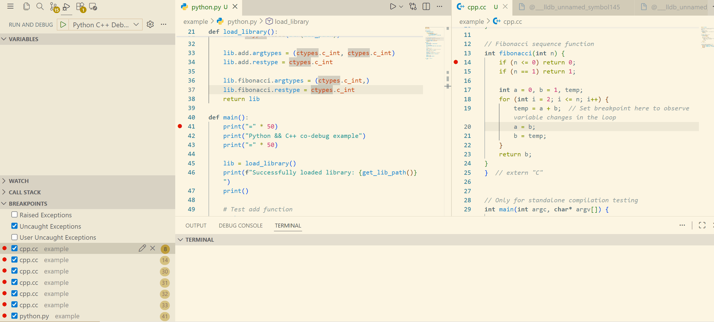

# VS Code Python C++ Debugger

[English](readme.md) | [中文](readme_zh.md)

本调试器通过启动一个 Python Debugger，并附加一个 C++ 调试器，用于调试调用共享库文件（.so/.dll）内部函数的 Python 代码。



## 依赖要求

使用此调试扩展需要安装以下扩展：
* **Python** by Microsoft (`ms-python.python`)
* **C/C++** by Microsoft (`ms-vscode.cpptools`)
* **CodeLLDB** by Vadim Chugunov (`vadimcn.vscode-lldb`) - *可选，用于 LLDB 调试*

## 默认配置

**如果计划使用 Python 和/或 C++ 调试器的默认配置，则无需手动定义下面的配置。**

* **Python:** `pythonConfig: default` 将使用默认配置启动 Python 调试器（Python: Current File）
  
* **C++:** 
  - `cppConfig: default (win) Attach` - Windows 调试器 (cppvsdbg)
  - `cppConfig: default (gdb) Attach` - GDB 调试器（Linux 推荐）
  - `cppConfig: default (codelldb) Attach` - CodeLLDB 调试器（macOS 推荐，Linux 也可用）

## 使用默认配置（无需配置 C++ 调试器）

### 示例：
```json
{
  "version": "0.2.0",
  "configurations": [
    {
      "name": "Python C++ 联调",
      "type": "pythoncpp",
      "request": "launch",
      "pythonConfig": "default",
      "cppConfig": "default (gdb) Attach"
    }
  ]
}
```

## 自定义配置

手动定义配置，须将 `pythonLaunchName` 和 `cppAttachName` 设置为 `launch.json` 中的配置名称。

### 示例 1：Windows (cppvsdbg)

```json
{
  "version": "0.2.0",
  "configurations": [
    {
      "name": "Python C++ 联调",
      "type": "pythoncpp",
      "request": "launch",
      "pythonLaunchName": "Python: 当前文件",
      "cppAttachName": "(Windows) Attach"
    },
    {
      "name": "(Windows) Attach",
      "type": "cppvsdbg",
      "request": "attach",
      "processId": ""
    },
    {
      "name": "Python: 当前文件",
      "type": "debugpy",
      "request": "launch",
      "program": "${file}",
      "console": "integratedTerminal"
    }
  ]
}
```

### 示例 2：Linux (GDB)

```json
{
  "version": "0.2.0",
  "configurations": [
    {
      "name": "Python C++ 联调",
      "type": "pythoncpp",
      "request": "launch",
      "pythonLaunchName": "Python: 当前文件",
      "cppAttachName": "(gdb) Attach"
    },
    {
      "name": "(gdb) Attach",
      "type": "cppdbg",
      "request": "attach",
      "program": "/usr/bin/python3",
      "processId": "",
      "MIMode": "gdb",
      "setupCommands": [
        {
          "description": "为 gdb 启用整齐打印",
          "text": "-enable-pretty-printing",
          "ignoreFailures": true
        }
      ]
    },
    {
      "name": "Python: 当前文件",
      "type": "debugpy",
      "request": "launch",
      "program": "${file}",
      "console": "integratedTerminal"
    }
  ]
}
```

### 示例 3：macOS / Linux (CodeLLDB)

> **注意：** 需要安装 [CodeLLDB](https://marketplace.visualstudio.com/items?itemName=vadimcn.vscode-lldb) 扩展。

```json
{
  "version": "0.2.0",
  "configurations": [
    {
      "name": "Python C++ 联调",
      "type": "pythoncpp",
      "request": "launch",
      "pythonLaunchName": "Python: 当前文件",
      "cppAttachName": "(codelldb) Attach"
    },
    {
      "name": "(codelldb) Attach",
      "type": "lldb",
      "request": "attach",
      "pid": ""
    },
    {
      "name": "Python: 当前文件",
      "type": "debugpy",
      "request": "launch",
      "program": "${file}",
      "console": "integratedTerminal"
    }
  ]
}
```

## 工作原理

当启动 Python C++ Debugger 时，它会：
1. 启动 Python 调试器，并启用 `stopOnEntry`
2. 获取 Python 进程的 PID
3. 将 C++ 调试器附加到该进程
4. 继续 Python 执行（如果原本没有设置 `stopOnEntry`）

## 重要说明

* 确保加载的共享库文件（.so/.dll）是用 **调试信息** 编译的（使用 `-g` 标志）。
* 在 Python 和 C++ 代码之间设置的连续断点，只有 **继续** 按钮能正常工作。
* 由于 Python 调试器在重启后会更改其 processId，**重启** 按钮不受支持。

## 从源码构建

```bash
yarn install

yarn run compile

NODE_OPTIONS=--openssl-legacy-provider vsce package
```
